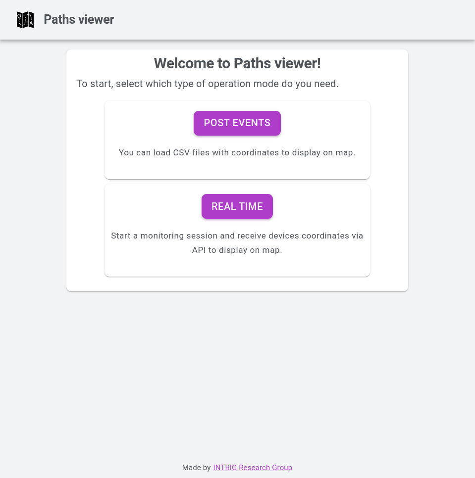
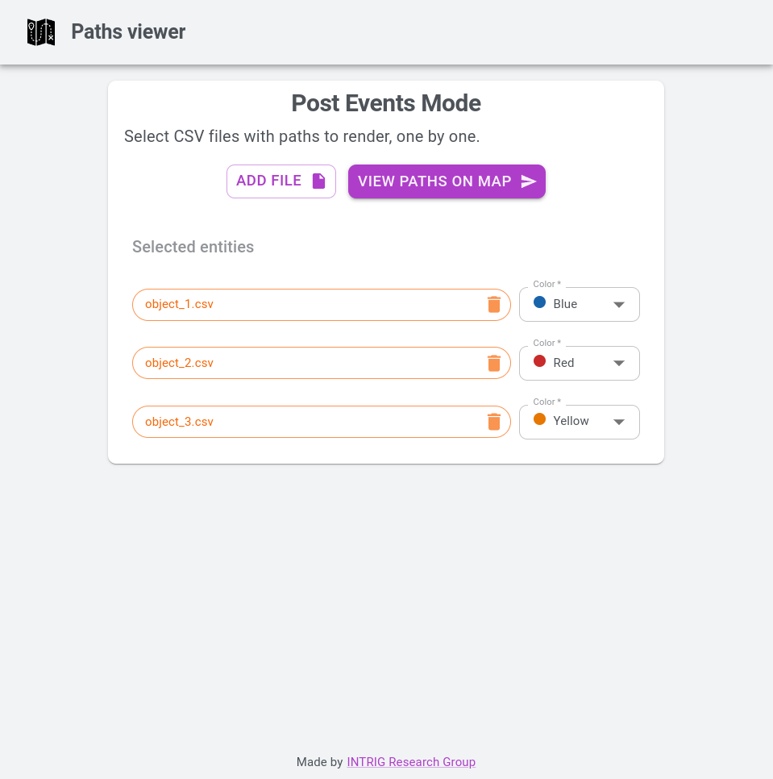
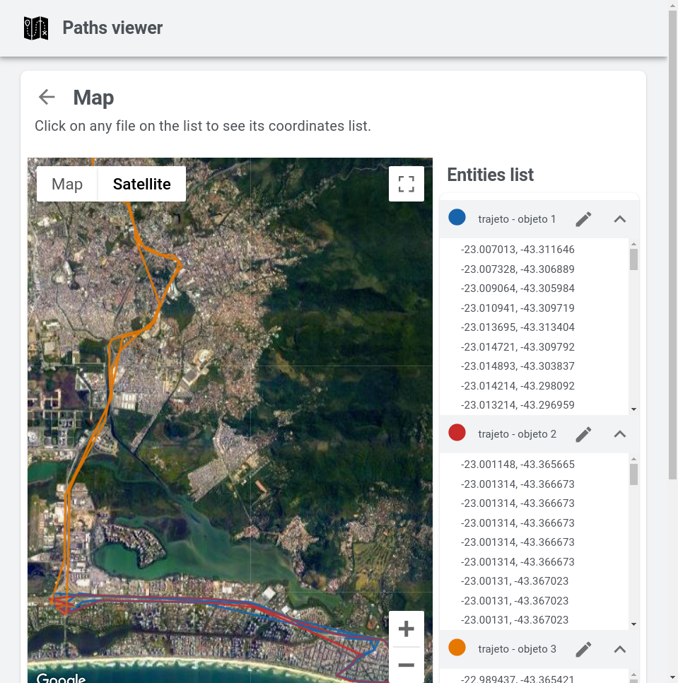
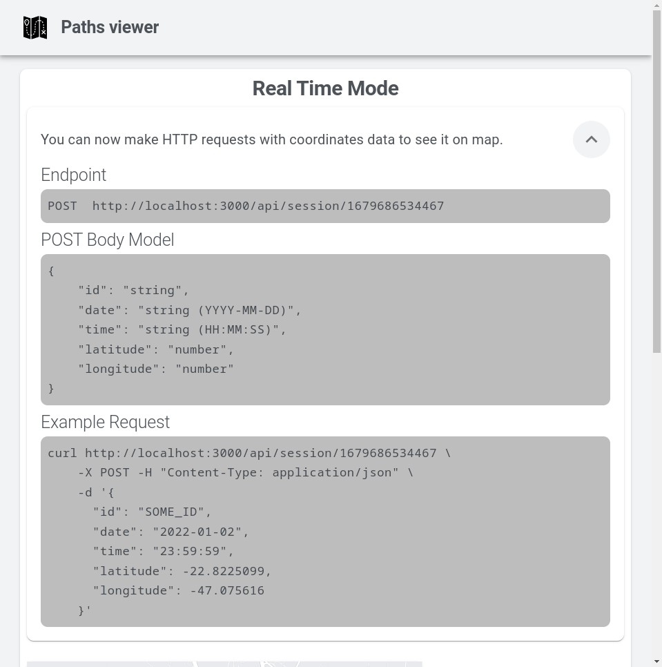
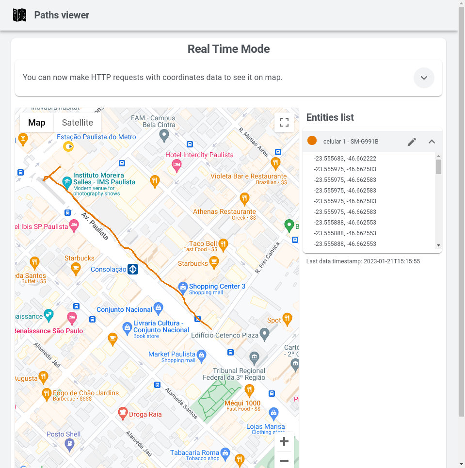

# PathsViewer

**PathsViewer** é uma ferramenta para visualização de dados espaço-temporais **em tempo real** ou **pós-eventos**. Essa ferramenta busca suprir a demanda por ferramentas de visualização de trajetórias de objetos, em vista do grande interesse em pesquisas nesse tipo de dado.

É possível utilizar conjuntos de dados variados, com estruturas diversas, tais como _traces_ de 5G georeferenciados e trajetórias de veículos.

Esse repositório (e sua [Wiki](//github.com/intrig-unicamp/paths-viewer/wiki/)) contém todo o código da ferramenta, como também instruções para execução, _deploy_, contribuição e demais informações.

## Demonstração de Uso
Para uma breve demonstração, acesse o **PathsViewer** no endereço [paths-viewer.vercel.app](https://paths-viewer.vercel.app/).

- A tela inicial apresenta a seleção dos modos de operação

<p align="center">
  
</p>

- Modo de operação **pós-eventos**

  Veja na imagem abaixo a interface para carregar os dados a serem utilizados no modo pós-eventos. É possível selecionar a visualização de mapa 2D ou satélite. Usando o ícone de edição ao lado de cada _dataset_, o usuário pode editar o nome e cor do traço. Também são listadas as coordenadas de cada coleta

  > 💡 Teste com os _datasets_ de exemplo na pasta [simulations](simulations)

<p align="center">
  
  
</p>

- Modo de operação **em tempo real**

  Também podemos realizar o envio de dados em tempo real através de dispositivos distribuídos. Na imagem abaixo, são exibidos os parâmetros de conexão para enviar dados para a API do **PathsViewer**, para que a interface no navegador exiba em tempo real as coletas realizadas 

  > 💡 Utilize o _script_ [realtime-sim](simulations/realtime-sim.py) para simular o envio dos dados em tempo real

<p align="center">
  
  
</p>

## 🚀 Configuração inicial
Essas instruções vão permitir que você tenha uma cópia funcional do projeto na sua máquina local para desenvolvimento e testes.

### 📋 Requisitos
- [NodeJS v18.3.0 LTS / NPM v8.11](https://nodejs.org/pt-br/download/) (recomenda-se fortemente a utilização do [NVM](https://github.com/nvm-sh/nvm) para gerenciar facilmente as versões do NodeJS)
- [Yarn](https://yarnpkg.com/getting-started/install)
- [Gerar as credenciais do Firebase](//github.com/intrig-unicamp/paths-viewer/wiki/Gerar-as-Credenciais-do-Firebase)

### 🔧 Instalação
- Clone o repositório
```sh
git clone https://github.com/intrig-unicamp/paths-viewer.git
cd paths-viewer # entre na pasta onde foi feito o clone
```

- (se utilizar _NVM_): Configure a versão NodeJS correspondente
```sh
nvm install
nvm use # necessário executar sempre que for iniciar o projeto
```

- Instale as dependências do projeto
```sh
yarn install
```

- Inicie o projeto no modo desenvolvedor
```sh
yarn dev
```
Por padrão, a interface deverá iniciar no endereço [http://localhost:3000](http://localhost:3000).

> 💡 Consulte o [guia de instalação](//github.com/intrig-unicamp/paths-viewer/wiki/Instalação) na Wiki para mais exemplos e casos de uso.

## 📊 Banco de Dados
Utilizamos o Firebase como solução de banco de dados, tanto em produção quanto desenvolvimento. É necessário gerar as credenciais necessárias para executar o projeto sem problemas. Siga o [guia respectivo na Wiki](//github.com/intrig-unicamp/paths-viewer/wiki/Gerar-as-Credenciais-do-Firebase) para mais informações.

## 👏 Contribuições
Todos são bem-vindos a realizar contribuições e sugestões no código! Recomenda-se enviar *pull requests* ou então criar *issues*. A nossa equipe analisará em breve.

## Licença
Esse projeto adere à licença **MIT**. Consulte o [arquivo LICENSE](LICENSE) para mais informações.

Copyright © [INTRIG Research Group](//github.com/intrig-unicamp/).
